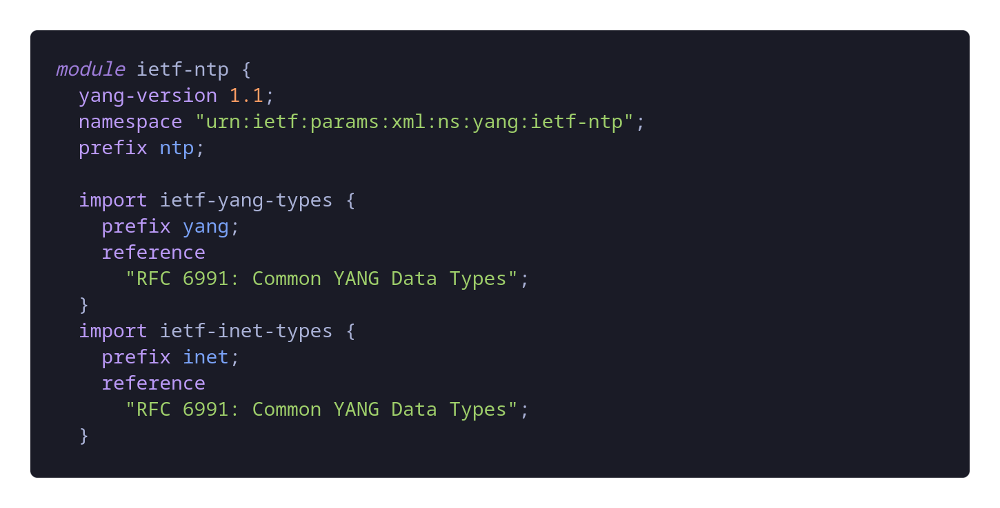
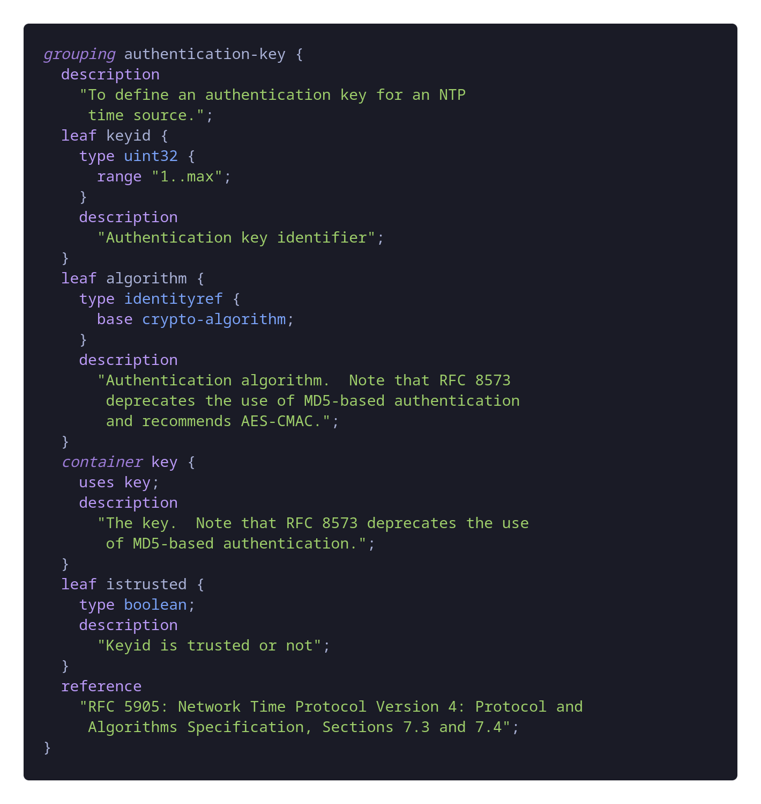

# YANGCraft - syntax highlighter and snippets  

Yet Another Extension for VS Code to work with YANG. This extension is a syntax highlighter for YANG data modeling files. Besides that, it also uses some useful snippets when writing YANG models.

## Features

### Snippets

The following snippets are available once the extension is enabled: 

| **Snippet Name**               | **Call Name**       |
|--------------------------------|---------------------|
| module                         | `module`            |
| import                         | `import`            |
| typedef                        | `typedef`           |
| feature                        | `feature`           |
| identity                       | `identity`          |
| grouping                       | `grouping`          |
| container                      | `container`         |
| container with when statement  | `when-container`    |
| rpc                            | `rpc`               |
| leaf-list                      | `leaf-list`         |
| list                           | `list`              |
| leaf                           | `leaf`              |
| presence                       | `presence`          |
| config                         | `config`            |
| uses                           | `uses`              |
| description`                   | `description`       |

### Syntax Highlight

The YANG modeling looks like this with the extension





## Requirements

This extension does not have any third-party dependency. It should work out-of-the box if you have a up-to-date VS Code.

## TROUBLESHOOTING

> Why I don't see a highlight in some of the keywords like in the photo? Like module or grouping?

It is possible that your VS Code theme does not have a color by default for the TextMate grammar `meta.function.definition`. You could added and use the color that you prefer. This example is for the Dark+ default theme of VS Code, you should edit this in you User settings 

<kbd>Ctrl</kbd> + <kbd>Shift</kbd> + <kbd>P</kbd> and search for *Open User settings (JSON)* 

See [Editor Semantic Highlighting](https://code.visualstudio.com/docs/getstarted/themes#_editor-semantic-highlighting) for more details

```json
"editor.tokenColorCustomizations": {
    "[Default Dark+]": {
        "textMateRules": [
            {
                "scope": "meta.function.definition.yang",
                "settings": {
                    "fontStyle": "italic",
                    "foreground": "#C586C0"
                }
            },
        ]
    }
}
```

If this is not the case, I may forgot to add a keyword, so let me know in the issues section of the repository.

## Acknowledgement 

- I was upon the work of [`marko2276`](https://github.com/marko2276) and their VS Code extension to create this one. Many thanks! 